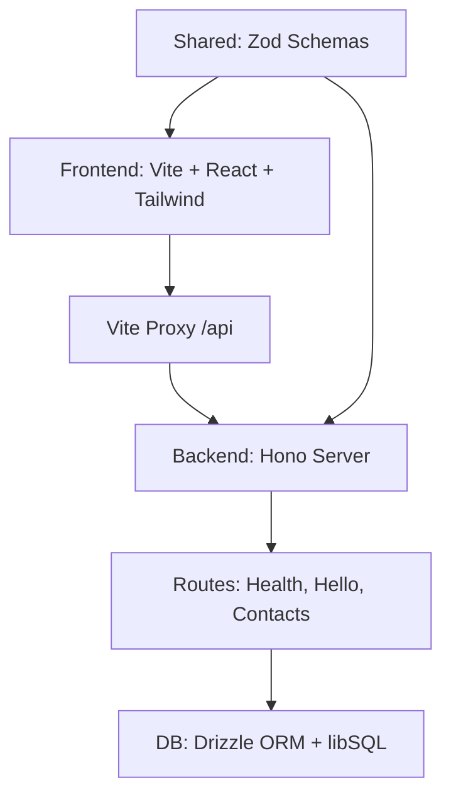

# Portfolio Contact Flow, Deno, Hono, Vite, React

A small full stack app for a contact flow, a public Contact page that submits to an API, a Thank You page, and a simple Contacts list. Runtime is Deno v2, server is Hono, client is Vite + React, persistence will use Drizzle ORM with libSQL.

> **🚧 Work in Progress**:  
> This project is under active development and is not yet production-ready.  
> Use at your own risk, and note that documentation may be incomplete or subject to change.

[](https://github.com/AndrewWilks/portfolio-contact-us/actions/workflows/ci.yml)
[](https://github.com/AndrewWilks/portfolio-contact-us/actions/workflows/ci.yml)
[](https://www.typescriptlang.org/)
[](https://deno.com/)

## Stack

- Runtime, Deno v2
- API, Hono
- Web, Vite + React
- ORM, Drizzle ORM, libSQL client
- Testing, Deno test for API, Vitest for UI
- Config, `.config` holds Vite, ESLint, tsconfigs, cspell
- Tasks and imports live in `deno.json`, see scripts below, :contentReference[oaicite:0]{index=0}

## Dev setup

```bash
cp .env.example .env

# terminal 1, run both
deno task dev

# or, separate
deno task dev:api
deno task dev:vite
```

- Web app on [http://localhost:3000](http://localhost:3000)
- API on [http://localhost:8000](http://localhost:8000)
- The web app calls the API via the Vite proxy, fetch to `/api/...` inside the frontend, no absolute host strings needed

## Vite proxy

Vite proxies `/api` to the backend during `dev`, so the browser talks to the same origin, CORS stays quiet, and frontend code can use `fetch("/api/hello")`.
If you change the backend port, update `.config/vite.config.ts` to match. For production, serve the frontend behind a reverse proxy that forwards `/api` to the Hono server, or configure the frontend build output to the same origin as the API.

## Environment

`.env.example` provides:

```properties
API_PORT=8000
API_ORIGINS=http://localhost:3000
VITE_API_URL=/api
VITE_APP_ENV=development
```

`VITE_API_URL` uses `/api` by default to align with the proxy, you can swap it later if you deploy the UI and API on different origins.

## Scripts

From `deno.json`:

- `dev`, run API and Vite together
- `dev:api`, run the Hono server with env and net permissions
- `dev:vite`, run Vite with the shared config

You can inspect or tweak these in `deno.json`, the imports map also pins versions,

## API, quick smoke

- `GET /api/health`, returns `{ ok: true }`
- `GET /api/hello`, returns `{ message: "Hello from Deno + Hono" }`

Use these to confirm the proxy and server are working.

## Project structure

```text
.config/        central configs, vite, eslint, tsconfigs, cspell
.plan/specs/    plans and specs, API contract, data model
backend/        db, routes, server
frontend/       Vite + React app
shared/         shared types, entities, config loader
```

## Architecture



## Development plan

See `.plan/specs/plan.md` for phased work, setup, and issue sequencing.

### Phase 0 Goals (Bootstrap)

- Implement API hello routes (`/api/health`, `/api/hello`)
- Create basic Vite app home page that fetches `/api/hello`
- Set up basic tests (Deno for API, Vitest for UI)
- Ensure central configs (lint, format, build) work
- Demonstrate Tailwind CSS integration in UI

## Conventions

- Zod will define request and form schemas, shared where practical
- Drizzle schema mirrors Zod types for persistence
- Error responses follow `{ ok, data, error }`
- `.gitkeep` files ensure empty folders are tracked
- cspell runs with `.config/cspell.json` to keep spelling tidy

## Troubleshooting

- If the UI shows “could not reach API”, check the API terminal logs, confirm `API_PORT` and the Vite proxy target match
- If CORS appears in logs, verify `API_ORIGINS` includes the Vite dev origin, usually `http://localhost:3000`
