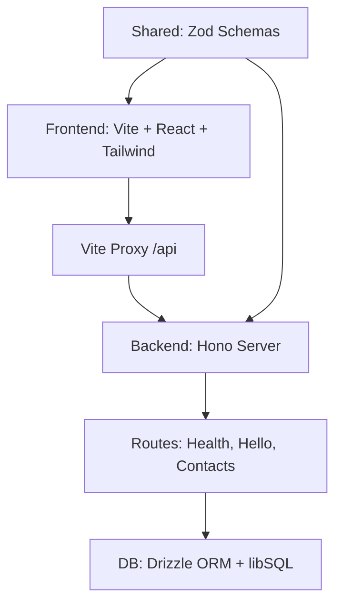

# Portfolio Contact Flow, Deno, Hono, Vite, React
## Contacts API (endpoints)

Below are the endpoints implemented in this sprint with example requests and typical responses. The API uses the envelope pattern `{ ok, data, error }`.

### POST /api/contacts

- Description: Create a new contact.
- Request body (JSON):

```json
{
  "firstName": "John",
  "lastName": "Doe",
  "email": "john.doe@example.com",
  "phone": "0412 345 678",
  "message": "Hello!"
}
```

- Success response: 201 Created

```json
{
  "ok": true,
  "data": {
    "id": "<uuid>",
    "firstName": "John",
    "lastName": "Doe",
    "email": "john.doe@example.com",
    "phone": "0412 345 678",
    "message": "Hello!",
    "verified": false,
    "createdAt": 1698200000000
  }
}
```

- Validation error: 400 Bad Request (envelope with `ok: false` and `error` object)

### GET /api/contacts

- Description: List contacts. Supports query filters.
- Query parameters:
  - `q` (string, optional) — search first/last/email
  - `verified` (boolean, optional) — filter by verified status (`true`/`false`)
- Success response: 200 OK

```json
{
  "ok": true,
  "data": [ /* array of contact objects (same shape as POST response data) */ ]
}
```

### PATCH /api/contacts/:id/verify

- Description: Mark a contact as verified. `:id` is the contact UUID path param.
- Success: 200 OK with updated contact in the `data` envelope.
- Not found: 404 Not Found (envelope with `ok: false` and `error`)

### DELETE /api/contacts/:id

- Description: Delete a contact by id.
- Success: 204 No Content (empty body).
- Not found: 404 Not Found.

Try a quick curl (PowerShell) POST example:

```powershell
curl -X POST "http://localhost:8000/api/contacts" \
  -H "Content-Type: application/json" \
  -d '{"firstName":"John","lastName":"Doe","email":"john.doe@example.com"}'
```

Or a fetch example in Node/Deno/Browser:

```js
const res = await fetch("http://localhost:8000/api/contacts", {
  method: "POST",
  headers: { "content-type": "application/json" },
  body: JSON.stringify({ firstName: "John", lastName: "Doe", email: "john.doe@example.com" }),
});
const body = await res.json();
```
- `GET /api/health`, returns `{ ok: true }`
- `GET /api/hello`, returns `{ message: "Hello from Deno + Hono" }`

Use these to confirm the proxy and server are working.

## Contacts API (endpoints)

Below are the endpoints implemented in this sprint with example requests and typical responses. The API uses the envelope pattern `{ ok, data, error }`.

- POST /api/contacts
  - Description: Create a new contact.
  - Request body (JSON):

```json
{
  "firstName": "John",
  "lastName": "Doe",
  "email": "john.doe@example.com",
  "phone": "0412 345 678", // optional
  "message": "Hello!" // optional
}
```

- Success response: 201 Created

```json
{
  "ok": true,
  "data": {
    "id": "<uuid>",
    "firstName": "John",
    "lastName": "Doe",
    "email": "john.doe@example.com",
    "phone": "0412 345 678",
    "message": "Hello!",
    "verified": false,
    "createdAt": 1698200000000
  }
}
```

- Validation error: 400 Bad Request (envelope with `ok: false` and `error` object)

- GET /api/contacts
  - Description: List contacts. Supports query filters.
  - Query parameters:
    - `q` (string, optional) — search first/last/email
    - `verified` (boolean, optional) — filter by verified status (`true`/`false`)
  - Success response: 200 OK

```json
{
  "ok": true,
  "data": [
    /* array of contact objects (same shape as POST response data) */
  ]
}
```

- PATCH /api/contacts/:id/verify

  - Description: Mark a contact as verified. `:id` is the contact UUID path param.
  - Success: 200 OK with updated contact in the `data` envelope.
  - Not found: 404 Not Found (envelope with `ok: false` and `error`)

- DELETE /api/contacts/:id
  - Description: Delete a contact by id.
  - Success: 204 No Content (empty body).
  - Not found: 404 Not Found.

Try a quick curl (PowerShell) POST example:

```powershell
curl -X POST "http://localhost:8000/api/contacts" \
  -H "Content-Type: application/json" \
  -d '{"firstName":"John","lastName":"Doe","email":"john.doe@example.com"}'
```

Or a fetch example in Node/Deno/Browser:

```js
const res = await fetch("http://localhost:8000/api/contacts", {
  method: "POST",
  headers: { "content-type": "application/json" },
  body: JSON.stringify({
    firstName: "John",
    lastName: "Doe",
    email: "john.doe@example.com",
  }),
});
const body = await res.json();
```

## Running the integration tests (backend)

These integration tests exercise the real Drizzle/db repository against a temporary SQLite file. The tests and utilities live under `backend/__tests__` and use the shared `clearContacts` and repo functions for setup/teardown.

1. Create an env file for tests (recommended):

```properties
# .env.test
DB_FILE_NAME=sqlite:./tmp/test.sqlite
NODE_ENV=test
BACKEND_PORT=8001
```

2. Ensure the DB schema exists (run migrations) or create an empty sqlite file:

```powershell
# Apply migrations using drizzle-kit (recommended)
deno task db:push --env-file ./.env.test

# Or create an empty sqlite file
mkdir .\tmp -ErrorAction SilentlyContinue
New-Item -Path .\tmp\test.sqlite -ItemType File -Force
```

3. Run the integration tests (example runs only the contacts endpoints):

```powershell
deno test --allow-all --env-file ./.env.test backend/__tests__/integration --no-check
```

Notes:

- The tests require filesystem access and permission to create/read the temp sqlite file; `--allow-all` is used for convenience in local runs. Tighten permissions for CI as needed.
- `deno task db:push` relies on `.config/drizzle.config.ts` and drizzle-kit; ensure your environment allows running the npm driver used by drizzle-kit.
- Running tests against a separate DB file avoids impacting your development DB at `backend/db/_db.sqlite`.

## Project structure

```text
.config/        central configs, vite, eslint, tsconfigs, cspell
.plan/specs/    plans and specs, API contract, data model
backend/        db, routes, server
frontend/       Vite + React app
shared/         shared types, entities, config loader
```

## Architecture



## Development plan

See `.plan/specs/plan.md` for phased work, setup, and issue sequencing.

### Phase 0 Goals (Bootstrap)

- Implement API hello routes (`/api/health`, `/api/hello`)
- Create basic Vite app home page that fetches `/api/hello`
- Set up basic tests (Deno for API, Vitest for UI)
- Ensure central configs (lint, format, build) work
- Demonstrate Tailwind CSS integration in UI

## Conventions

- Zod will define request and form schemas, shared where practical
- Drizzle schema mirrors Zod types for persistence
- Error responses follow `{ ok, data, error }`
- `.gitkeep` files ensure empty folders are tracked
- cspell runs with `.config/cspell.json` to keep spelling tidy

## Troubleshooting

- If the UI shows “could not reach API”, check the API terminal logs, confirm
  `API_PORT` and the Vite proxy target match
- If CORS appears in logs, verify `API_ORIGINS` includes the Vite dev origin,
  usually `http://localhost:3000`

## Developer notes

- A fast backend unit test was added to validate the `/hello` contract without
  starting a network server. The test imports the Hono app and calls the handler
  directly. File: `backend/__tests__/hello.test.ts`.

- The server startup in `backend/server.ts` is guarded so tests can import the
  app safely without opening network sockets:

```ts
if (import.meta.main) {
  // start server here
}
```

- Run the new backend unit test locally (CI uses the same command):

```bash
deno test --allow-env --env-file=./.env backend/__tests__/hello.test.ts --no-check
```

These notes are part of Phase 0 developer guidance and keep the test workflow
fast and deterministic for CI.

## Testing with a temporary database (recommended)

The repository uses a SQLite (libSQL) file for local development and tests. To run the backend unit tests locally against a temporary database, follow these steps.

1. Create a `.env.test` file at the repository root with a temporary DB path and minimal env vars:

```properties
# .env.test
DB_FILE_NAME=sqlite:./tmp/test.sqlite
NODE_ENV=test
BACKEND_PORT=8001
```

2. Ensure the DB schema exists. If you use Drizzle migrations, run the migration push against the test env:

```powershell
deno task db:push --env-file ./.env.test
```

If you don't have migrations ready, you can create the DB folder and an empty sqlite file before running tests:

```powershell
mkdir .\tmp -ErrorAction SilentlyContinue
New-Item -Path .\tmp\test.sqlite -ItemType File -Force
```

3. Run the tests (backend-only example):

```powershell
deno test --allow-all --env-file ./.env.test backend/__tests__/repos --no-check
```

Notes:

- `--allow-all` is used in tests to allow file I/O and temporary DB access. For CI you may tighten permissions as needed.
- The tests expect the `contacts` table/schema to exist. `deno task db:push` uses `drizzle-kit` and `.config/drizzle.config.ts` to apply migrations when available.
- Using a dedicated `DB_FILE_NAME` for tests keeps your local development DB separate and prevents accidental data loss.
